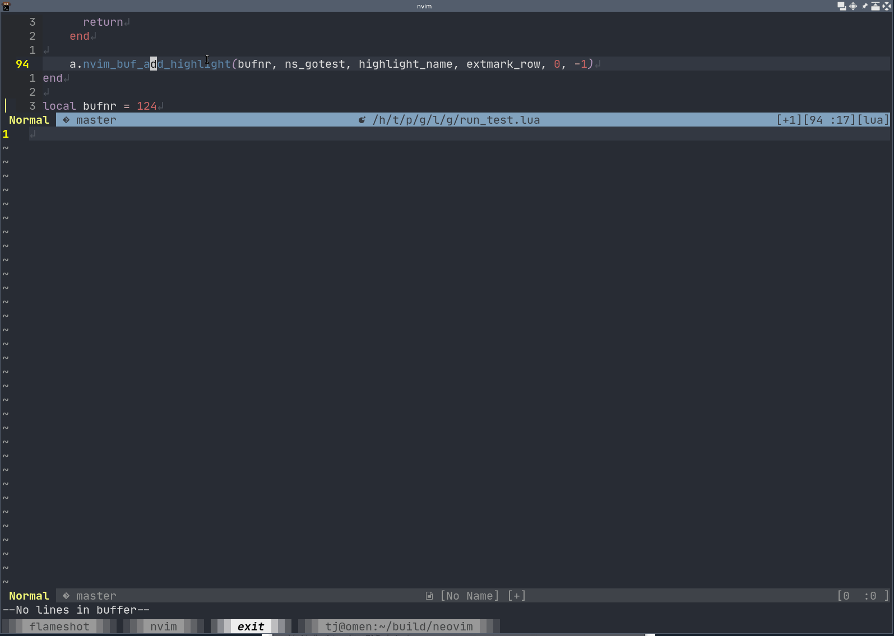

# green_light.nvim

GO GO GO GO

## What?

It's some utilties for Go code that I'm working on.

It is unlikely I'll make changes to do complicated support, since I'm just working on it myself.
It would be a mistake to depend on the current API :)

## Still here?

Install:

```
use 'nvim-lua/plenary.nvim'
use 'tjdevries/green_light.nvim'
```


## What does it do?

Better go test highlighting (soon goto failed test, move between tests, etc.)


